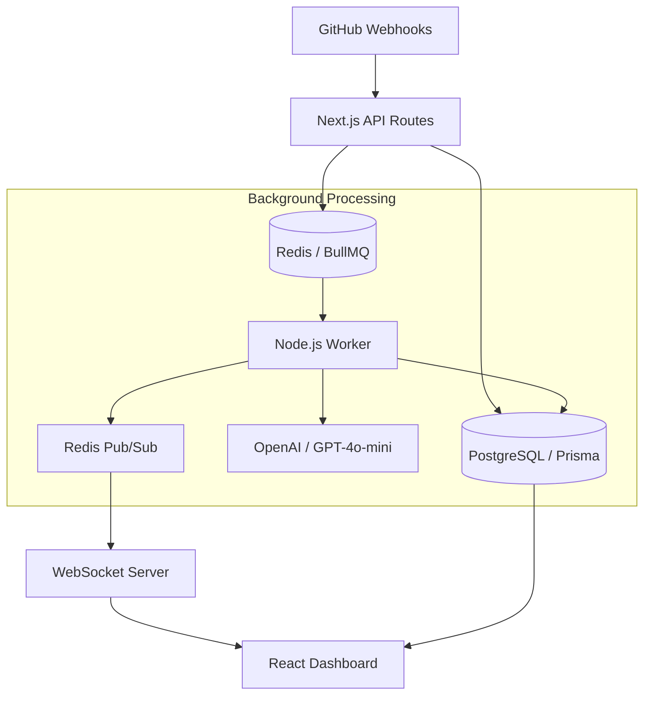

# DevPulse

[](https://github.com/amanasati01/devpulse/actions)
[](https://opensource.org/licenses/MIT)
[](https://makeapullrequest.com)

**DevPulse** is a high-signal engineering intelligence platform that transforms raw GitHub data into actionable insights. It combines live DORA metrics with AI-powered risk assessment to give engineering leaders a clear pulse on their delivery health.

[**Explore the Demo Mode**](https://devpulse-rxd6.onrender.com/demo) • [**View Sample Dashboard**](#-key-features)

---

## 🚀 Key Features

- **🤖 AI Risk Radar**: Every Pull Request is automatically analyzed by GPT-4o-mini to detect massive refactors, architectural shifts, or high-risk logic changes before they merge.
- **📊 Real-time DORA Metrics**: Instant visibility into Deployment Frequency, Lead Time for Changes, Change Failure Rate, and MTTR. No manual tracking, no stale spreadsheets.
- **🚨 Incident Correlation**: Correlate deployment events with operational incidents to identify patterns and ensure team stability.
- **⚡️ Live Stream**: A low-latency WebSocket feed of engineering events, allowing you to see the "heartbeat" of your development organization as it happens.
- **🏢 Multi-Tenant SaaS Core**: Built on a robust PostgreSQL + Prisma foundation with strict organization-level data isolation and GitHub OAuth integration.

---

## 🛠 Architecture

DevPulse uses a modern, distributed architecture designed for scale and reliability:



### Tech Stack
- **Frontend**: Next.js 14 (App Router), Tailwind CSS, Lucide React
- **Backend**: Node.js, BullMQ, WebSocket (ws)
- **Database**: PostgreSQL (Prisma ORM)
- **Caching/Queuing**: Redis
- **AI**: OpenAI API (Vercel AI SDK)
- **Infrastructure**: Turborepo (Monorepo), Docker, Render

---

## 🚦 Quick Start

### Prerequisites
- Node.js 20+
- pnpm 9+
- Docker (for local database and redis)

### Installation

1. **Clone the repo and install dependencies**:
   ```bash
   git clone https://github.com/amanasati01/devpulse.git
   cd devpulse
   pnpm install
   ```

2. **Spin up local infrastructure**:
   ```bash
   docker compose up -d
   ```

3. **Configure Environment Variables**:
   Copy the example file and fill in your secrets (GitHub OAuth, OpenAI API Key, etc.):
   ```bash
   cp .env.example .env
   ```

4. **Initialize the Database**:
   ```bash
   pnpm db:generate
   pnpm db:migrate
   pnpm db:seed
   ```

5. **Start Development Servers**:
   ```bash
   pnpm dev
   ```
   *Your dashboard is now live at `http://localhost:3000`*

---

## ⚙️ Configuration

DevPulse is highly configurable via environment variables. Key configurations include:

| Variable | Description |
|----------|-------------|
| `DATABASE_URL` | PostgreSQL connection string |
| `REDIS_URL` | Redis connection string (use `rediss://` for TLS) |
| `GITHUB_WEBHOOK_SECRET` | Secret used to verify GitHub webhook signatures |
| `OPENAI_API_KEY` | Your OpenAI API key for risk scoring and summaries |
| `NEXT_PUBLIC_WS_URL` | The URL for the WebSocket server connection |

---

## 🧪 Testing

We take reliability seriously. DevPulse includes a comprehensive test suite powered by **Vitest**.

```bash
# Run unit and integration tests
pnpm test

# Run with coverage report
pnpm test -- --coverage
```

---

## 📄 License

Distributed under the MIT License. See `LICENSE` for more information.

---

<p align="center">
  Built with ❤️ for Engineering Leaders
</p>
